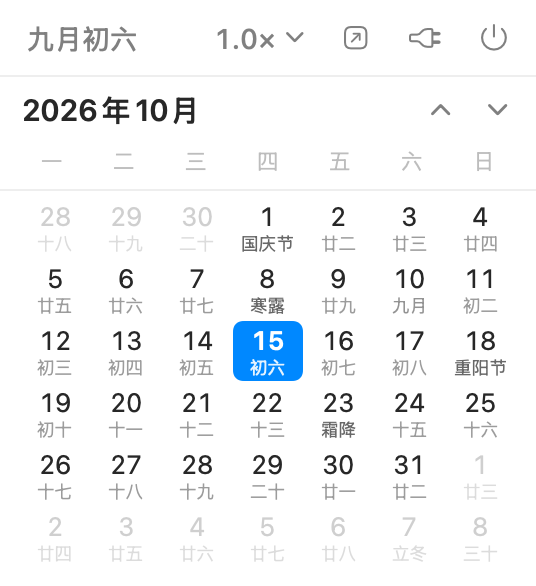
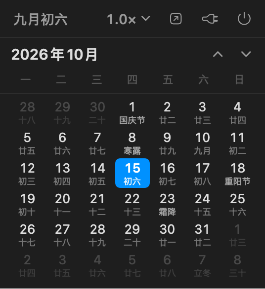

# ScrollCal · 滚动日历

一个 macOS 菜单栏日历：**点一下弹出、连续滚动、一屏一个月**，带农历、二十四节气和节日。
纯 SwiftUI + AppKit 写成，无第三方依赖、无网络请求，整个 App 不到 1 MB。

> A lightweight macOS menu bar calendar with continuous month scrolling, Chinese lunar dates,
> 24 solar terms and festivals. Pure SwiftUI/AppKit, zero dependencies, no network access.

<p align="center">
  
  &nbsp;&nbsp;&nbsp;
  
</p>

## 特性

- **连续滚动**：不像系统小组件那样只能看当月，滚轮/触控板可以一路滚下去（默认前后共 61 个月）
- **一屏一个月**：视口高度正好是一个月，滚起来边界感很清楚
- **滚动倍率可调**：点右上角 `1.0×` 展开倍率条，预设 0.2× / 0.5× / 0.8× / 1.0× / 1.5× / 2.0×，两端 `−` `+` 按 0.1× 微调（0.1×–3.0×），鼠标与触控板都能调到手感合适
- **农历 + 二十四节气 + 节日**：每格下方小字，优先级为 公历节日 → 农历节日 → 除夕 → 节气 → 农历初一(显示月名) → 农历日
- **非本月日期灰掉**，不是留空，跨月看前后几天很方便
- **跟随系统**：深浅色、语言、周一/周日起始（默认周一）都自动适配
- **原生轻量**：`LSUIElement` 菜单栏 App，没有 Dock 图标；开机自启、打开系统「日历」、定位今日都在面板第一行

## 安装

1. 到 [Releases](../../releases/latest) 下载 `ScrollCal-x.y.dmg`（或 `.zip`）
2. 打开 DMG，把 `ScrollCal.app` 拖进「应用程序」
3. **第一次打开**：因为项目没有 Apple 开发者签名，macOS 会拦一下。二选一：
   - 在「访达」里**右键点 App → 打开 → 再点"打开"**；或
   - 终端执行一次：`xattr -dr com.apple.quarantine /Applications/ScrollCal.app`
4. 打开后菜单栏会出现 `📅` 图标，点它即弹出日历

系统要求：macOS 14.0 或更高（在 macOS 26 上开发和测试）。

## 使用

| 位置 | 功能 |
| --- | --- |
| 第一行左 | 农历今日（如 `八月初八`），点击回到本月；快捷键 `⌘T` |
| 第一行右 | 滚动倍率（点开选择）· 打开「日历」App · 开机自启 · 退出 `⌘Q` |
| 第二行 | 当前年月 + `▲` `▼` 精确翻月 |
| 日历区 | 滚轮/触控板连续滚动，顶部年月自动跟随 |

开机自启用的是系统原生 `SMAppService`，不依赖任何自动化权限；如果注册失败，面板会提示你手动到
「系统设置 → 通用 → 登录项与扩展」里添加。

## 从源码构建

只需要 Xcode Command Line Tools（**不需要完整 Xcode**）：

```bash
git clone https://github.com/KatouMegumii/ScrollCal.git
cd ScrollCal
./build.sh      # 编译并打包到 build/ScrollCal.app
./install.sh    # 可选：装到 /Applications 并重启
```

`build.sh` 用 `swiftc` 直接编译 SwiftUI App 并手工组装 `.app` bundle，再 ad-hoc 签名。

### 仓库里的工具

| 工具 | 用途 |
| --- | --- |
| `Tools/CalendarDump/` | 命令行打印某月网格，校验农历/节气/节日：`./build/caldump 2026 10` |
| `Tools/Preview/` | 离屏渲染面板为 PNG，改样式时不用点菜单栏：`./build/preview out.png dark 2026 10` |
| `Tools/GenerateIcon.swift` + `Tools/make-icon.sh` | 生成 App 图标（iconset → icns），颜色/尺寸可调 |

> 小坑记录：`ImageRenderer` 不渲染 `ScrollView` 的内容，也会给 `NSViewRepresentable` 画"无法渲染"占位符，
> 所以预览模式下这两处都换成了等价的静态实现（见源码里的 `#if PREVIEW`）。

## 农历与节气是怎么算的

- **农历**：Foundation 内置的 Chinese calendar 换算（含闰月判定）
- **二十四节气**：自实现 Meeus《Astronomical Algorithms》低精度太阳视黄经求解（精度约 0.01°，约 15 分钟），离线计算，不查表、不联网
- **节日**：公历固定节日 + 按星期推算（母亲节/父亲节/感恩节）+ 农历节日（春节/元宵/龙抬头/端午/七夕/中秋/重阳/腊八/小年）+ 除夕
- 校验方式：`Tools/CalendarDump` 的输出与纸质日历逐格比对过（2026 年 9–10 月、2027 年 1–2 月等）

## 已知限制

- App 为 **ad-hoc 签名、未公证**，所以首次打开需要右键打开或去掉隔离属性（见上文）
- 只在 Apple 芯片的 macOS 26 上实测过；代码按 macOS 14.0 编译，理论上 Intel 机器也能跑（`arm64` 目标是写死的，改 `build.sh` 里的 `TARGET` 即可）
- 不支持日程显示（有意为之：只做日历本身，不申请日历权限）

## 许可

[MIT](LICENSE)
